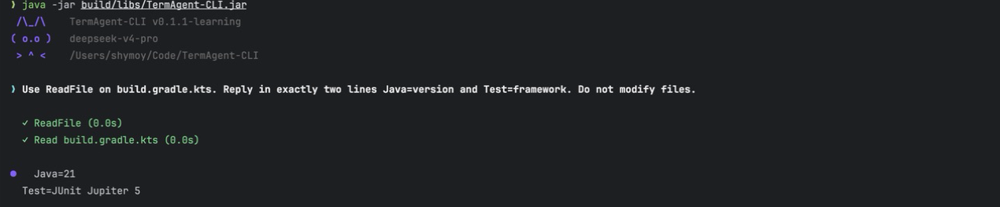
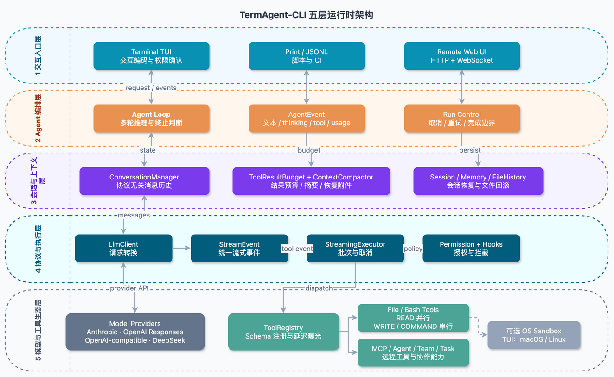
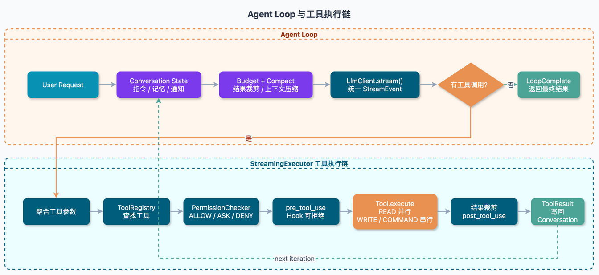

<div align="center">

# TermAgent-CLI

**用 Java 21 从零实现的终端 AI 编程 Agent Runtime**

统一多模型流式协议、Tool Calling、上下文管理、权限控制与多 Agent 协作。

[](https://openjdk.org/projects/jdk/21/)
[](https://gradle.org/)
[](https://modelcontextprotocol.io/)
[](src/test/java)

[运行截图](#运行截图) · [核心能力](#核心能力) · [五层架构](#五层架构) · [核心链路](#核心链路) · [能力矩阵](#入口能力矩阵) · [快速运行](#3-分钟快速运行) · [能力边界](#当前能力边界)

</div>

## 项目定位

TermAgent-CLI 不是对 LLM API 的简单封装，而是一套可持续执行任务的 **Agent Runtime**。模型可以读取和修改代码、执行命令、调用本地与 MCP 工具、拆分子任务，并在多轮 `LLM → Tool → Result → LLM` 循环中推进工作。

项目主要展示五类工程能力：**模型协议适配、Agent Loop、上下文工程、工具运行时和安全执行边界**。同一套核心运行时服务于终端 TUI、脚本化 Print 模式和 Remote Web UI，但三个入口的交互能力与安全装配并不完全相同。

> 面试快速阅读：先看[运行截图](#运行截图)和[五层架构](#五层架构)，再看[核心链路](#核心链路)与[入口能力矩阵](#入口能力矩阵)；完整源码事实和接线边界见[项目事实源](<docs/TermAgent-CLI 项目事实源.md>)。

## 运行截图



> 当前仓库实际运行：模型调用 `ReadFile` 读取 `build.gradle.kts`，工具结果回填后回答 Java 与测试框架；全程未修改文件。画面中的 Provider 来自本机配置，仓库不包含 API Key。

## 核心能力

| 能力 | 关键实现 |
|---|---|
| **统一模型适配** | `LlmClient` 屏蔽 Anthropic、OpenAI Responses、OpenAI-compatible 与 DeepSeek 的协议差异，统一输出 `StreamEvent` |
| **完整 Agent Loop** | 支持流式文本与 thinking、工具参数聚合、结果回填、错误重试、续写和协作式取消 |
| **上下文与恢复** | 大工具结果分级裁剪并落盘；接近窗口上限时摘要旧历史，同时保留最近消息、文件现场和会话边界 |
| **工具与协作运行时** | `ToolRegistry + StreamingExecutor` 统一本地工具、MCP 工具和子 Agent；相邻 READ 工具并行，WRITE 与 COMMAND 串行 |
| **安全执行链** | 危险命令硬拒绝、受保护路径、权限规则、用户确认和 Pre/Post Hook；TUI 可进一步启用 macOS/Linux OS 沙箱 |

## 五层架构

[](docs/termagent-runtime-arch.drawio)

> 从上到下依次是：交互入口、Agent 编排、会话与上下文、协议与执行、模型与工具生态。点击图片可打开 draw.io 源文件。

架构中的两个核心扩展边界是：

- 模型侧通过 `LlmClient + StreamEvent` 适配协议，Agent Loop 不依赖具体供应商 SDK；
- 工具侧通过 `Tool + ToolRegistry + StreamingExecutor` 接入，本地工具、MCP 和子 Agent 复用同一调度链。

## 核心链路

[](docs/termagent-agent-loop.drawio)

一次 Run 的核心过程：

1. `Agent` 向会话注入项目指令、长期记忆和后台任务通知。
2. 请求前固定工具 Schema，并由预算模块裁剪大结果、检查上下文是否需要压缩。
3. `LlmClient` 把内部消息转换为供应商请求，再将流式响应统一为 `StreamEvent`。
4. 如果模型产生工具调用，`StreamingExecutor` 依次完成工具查找、权限判断、Hook、调度和执行。
5. `ToolResult` 写回 `ConversationManager` 后进入下一轮；模型不再调用工具时发送 `LoopComplete`。

工具执行并发采用保守规则：连续的 `READ` 工具组成一个虚拟线程并行批次，`WRITE` 和 `COMMAND` 工具保持串行，结果顺序与模型调用顺序一致。

## 入口能力矩阵

下表描述的是**当前三个主入口的真实装配情况**，不是仅根据仓库中是否存在某个实现类判断：

| 能力 | TUI | Print | Remote |
|---|---|---|---|
| 交互方式 | 持续终端会话 | 单次 Prompt | 浏览器 + WebSocket |
| Provider 选择 | 启动时交互选择 | 配置中的第一项 | 配置中的第一项 |
| 输出 | 实时文本、thinking、工具状态 | 最终文本或 JSONL 事件 | WebSocket 事件流 |
| 权限交互 | 权限对话框与会话级放行 | 非交互；固定 BYPASS，但危险命令和保护路径仍硬拒绝 | 通过 WebSocket 回传确认 |
| OS 级 Bash 沙箱 | 支持；macOS Seatbelt / Linux bubblewrap | 当前未注入 | 当前未注入 |
| 当前 Run 取消 | `AgentRunHandle` 协作取消，并在写回前复查 | 依赖进程终止 | 可中断消费线程，对底层 Run 的保证弱于 TUI |
| 会话恢复 | `/resume` | 单次执行，不提供交互入口 | 支持恢复事件 |
| 文件/对话回滚 | `/rewind` | 不提供交互入口 | 当前明确返回不支持 |

因此，本项目当前最完整的体验是 **TUI**；Print 的目标是自动化，Remote 的目标是复用运行时事件协议，而不是与 TUI 完全等价。

## 三个关键设计

### 1. 协议差异止于 Adapter

`Agent` 只依赖 `LlmClient` 和统一事件。Anthropic content block、OpenAI Responses reasoning item、OpenAI-compatible SSE 与 DeepSeek `reasoning_content` 均在专用 Client 内转换。新增协议不需要修改 Agent Loop、工具系统或 UI。

### 2. MCP 复用普通工具链

`McpManager` 支持 stdio 与 Streamable HTTP，发现远程工具后将其包装成内部 `Tool`：

```text
MCP Server → McpToolWrapper → ToolRegistry → Permission → Hook → execute
```

MCP 工具默认延迟暴露，模型先通过 `ToolSearch` 发现并选择，下一轮才收到完整 Schema，避免大量定义占用首轮上下文。

### 3. 压缩后仍能恢复工作现场

上下文控制不是简单截断字符串，而是组合真实 token usage、工具结果预算、稳定落盘替换、旧历史摘要、最近消息保留与 `compact_boundary`。压缩或恢复会话后，Agent 仍能获得最近读取文件和工作状态的恢复附件。

## 3 分钟快速运行

### 1. 克隆项目

```bash
git clone https://github.com/shymoy/TermAgent-CLI.git
cd TermAgent-CLI
mkdir -p .termagent
```

### 2. 创建 `.termagent/config.local.yaml`

```yaml
providers:
  - name: deepseek
    protocol: deepseek
    model: deepseek-v4-pro
    thinking: true
    reasoning_effort: high
```

示例使用 `deepseek-v4-pro`；可用模型以 [DeepSeek 官方模型列表](https://api-docs.deepseek.com/api/list-models)为准。

### 3. 提供密钥并启动

```bash
export DEEPSEEK_API_KEY="your-api-key"
./gradlew run
```

项目要求 JDK 21，使用仓库自带的 Gradle Wrapper，无需安装本机 Gradle。首次运行需要下载依赖，实际耗时取决于网络。

其他入口：

```bash
# 单次文本输出
./gradlew run --args='-p "分析这个项目的核心架构"'

# JSONL 事件流，适合脚本和 CI
./gradlew run --args='-p "运行测试并总结结果" --output-format=stream-json'

# Remote Web UI：http://localhost:18888
./gradlew run --args='--remote'
```

构建可执行 Fat Jar：

```bash
./gradlew shadowJar
java -jar build/libs/TermAgent-CLI.jar
```

配置默认按以下顺序叠加，后者覆盖前者：

```text
~/.termagent/config.yaml
→ <project>/.termagent/config.yaml
→ <project>/.termagent/config.local.yaml
```

也可以通过 `TERMAGENT_CONFIG` 指定单独的配置文件。API Key 应通过 `ANTHROPIC_API_KEY`、`OPENAI_API_KEY` 或 `DEEPSEEK_API_KEY` 提供，不要提交到仓库。

## 当前能力边界

为了避免把“仓库中已有实现”包装成“所有入口均已完整接入”，当前版本明确保留以下边界：

- `permission_mode` 与 `sandbox` 可以被配置层解析，但尚未由三个主入口直接消费；实际权限模式与沙箱能力以入口装配为准。
- 自定义 command 文件、完整三层 Skill 加载和高级 Skill 执行语义、自定义 Agent 定义均已有底层实现，但尚未完整接入主入口。
- 子 Agent 应显式指定内置 `general-purpose`、`plan` 或 `explore` 类型；省略类型的 conversation fork 以及 model override 当前不保证生效。
- Remote 默认绑定 `0.0.0.0`，源码路径中没有可见鉴权，且 `/rewind` 尚不支持；不应直接暴露到不可信网络。
- MCP wrapper 当前只把文本内容写入 `ToolResult`；图片等非文本 MCP content 尚未进入主会话。

更完整的接线差异与风险清单见[项目事实源第 18 节](<docs/TermAgent-CLI 项目事实源.md#18-当前已确认的接线缺口与风险清单>)。

## 测试与验证

当前包含 **106 个 JUnit 5 自动化测试**，重点覆盖：

- Agent 运行、完成语义与协作取消；
- 上下文压缩、恢复附件与工具结果预算；
- 会话恢复、文件状态、指令和旧版路径兼容；
- 模型请求序列化、thinking、usage 与工具历史回传；
- Hook、ToolSearch、团队邮箱和 TUI 事件循环。

```bash
# 全部测试
./gradlew test

# 编译、测试并生成构建产物
./gradlew build

# 文档与补丁空白检查
git diff --check
```

测试通过不等于所有外部系统都完成端到端验证。Remote 网络协议、真实 MCP Server、OS 沙箱隔离和团队终端后端目前没有与核心 Agent Loop 同等强度的 E2E 覆盖。

## 源码导读

如果只有几分钟，建议按以下顺序阅读：

1. [`Agent.agentLoop`](src/main/java/io/github/shymoy/termagent/agent/Agent.java)：一次任务如何迭代、恢复和终止。
2. [`StreamingExecutor`](src/main/java/io/github/shymoy/termagent/agent/StreamingExecutor.java)：工具如何经过权限、Hook 与并发调度。
3. [`LlmClient`](src/main/java/io/github/shymoy/termagent/llm/LlmClient.java)：多模型协议的统一边界。
4. [`ToolRegistry`](src/main/java/io/github/shymoy/termagent/tool/ToolRegistry.java)：工具注册、Schema 转换和延迟曝光。
5. [`McpManager`](src/main/java/io/github/shymoy/termagent/mcp/McpManager.java)：MCP 工具如何进入普通工具链。
6. [`ContextCompactor`](src/main/java/io/github/shymoy/termagent/compact/ContextCompactor.java)：长任务如何压缩上下文并恢复现场。

## 项目文档

- [完整项目事实源](<docs/TermAgent-CLI 项目事实源.md>)：架构、调用链、配置、能力边界与源码索引。
- [五层 Runtime 架构图](docs/termagent-runtime-arch.drawio)：README 架构图的可编辑源文件。
- [Agent Loop 与工具执行链](docs/termagent-agent-loop.drawio)：核心链路图的可编辑源文件。
- [LLM API 会话流程图](docs/llm-api-conversation-flow.drawio)：模型请求、工具调用与结果回传流程。
- [贡献指南](AGENTS.md)：目录规范、编码风格、测试和提交约定。

---

<div align="center">

个人工程项目 · Maintained by [@shymoy](https://github.com/shymoy)

</div>
